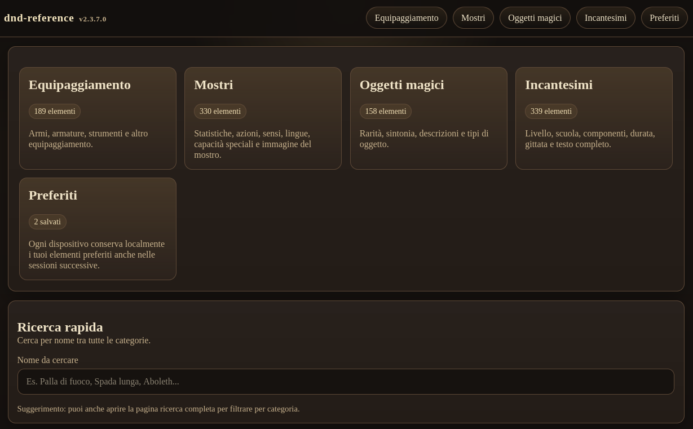
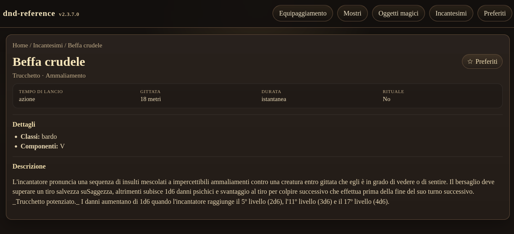
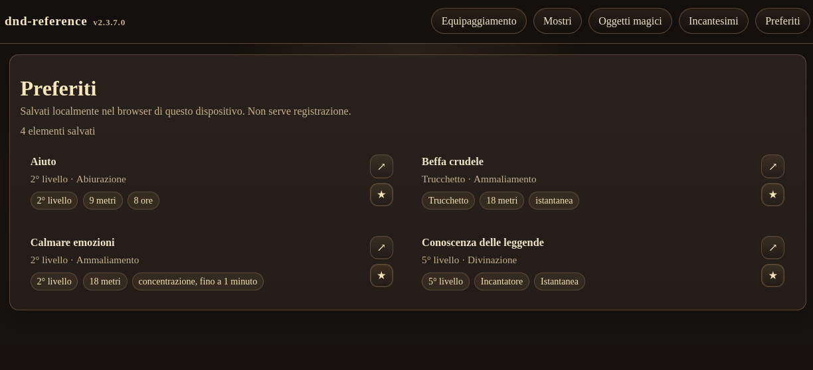

# DND-Reference
**dnd-reference** è una web app pensata per supportare le sessioni di *Dungeons & Dragons* (il gioco più bello del Mondo di [Wizards of the Coast](https://company.wizards.com/it)), permettendo a Dungeon Master e giocatori di consultare rapidamente tutte le informazioni principali del gioco.

L’app raccoglie in un’unica interfaccia:
- incantesimi
- mostri
- oggetti magici

Tutto è organizzato in modo semplice e leggibile, ottimizzato sia per desktop che per dispositivi mobile, così da essere utilizzabile direttamente al tavolo di gioco.
L'app fa uso del System Reference Document 5.2.1 rilasciato gratuitamente da Wizards. Si rimanda al documento di Licenza per i dettagli.

## Come usarla

Scarica tutto il progetto. Puoi clonarlo con git oppure scaricalo a mano. Per clonarlo con git usa il comando

``git clone https://github.com/massimobarbieri/dnd-reference.git``

``git submodule update --init --recursive``

**dnd-reference** è una webapp quindi ti serve un webserver qualunque (nginx o apache sono i più comuni) oppure puoi usare python3 durante le tue sessioni di gioco.
Se usi python, accedi alla cartella del progetto con il terminale e digita il seguente comando:

``python3 -m http.server 8080``

Il tuo pc diventerà un server web all'interno della tua rete locale. I tuoi utenti potranno collegarsi al tuo server locale all'indirizzo http://ip-del-tuo-server:8080

Una volta avviata sulla tua rete locale, puoi accedere all’app da qualsiasi dispositivo collegato alla tua rete (PC, tablet o smartphone) tramite browser.

## Sviluppo

Per verificare le fixture del dice roller:

``node tests/dice-roller.test.js``

Per verificare il markup del tray:

``node tests/roll-tray-markup.test.js``

Per verificare i dati mostri arricchiti:

``node tests/monster-rolls-data.test.js``

Per verificare i requisiti base di accessibilità del dice roller:

``node tests/roll-accessibility.test.js``

All’interno dell’app puoi:

- navigare tra le categorie (incantesimi, mostri, ecc.)
- cercare rapidamente un elemento per nome
- consultare le schede dettagliate durante la sessione
- salvare i tuoi elementi preferiti per averli sempre a portata di mano
- tirare formule di dado direttamente dalle schede o dal dice roller

L’app non richiede registrazione e salva i preferiti direttamente nel browser, così ogni giocatore può personalizzare la propria esperienza.

## Dice roller

Il dice roller riconosce formule come `d20`, `2d6 + 3`, `2d20kh1` e `4d6dl1` nel testo delle schede.

Per gli incantesimi con più bersagli, danni ripetuti o scaling non numerico, l’app non moltiplica automaticamente i risultati: mostra una nota situazionale e lascia al tavolo la scelta di quando ripetere il tiro.

### Schermate

